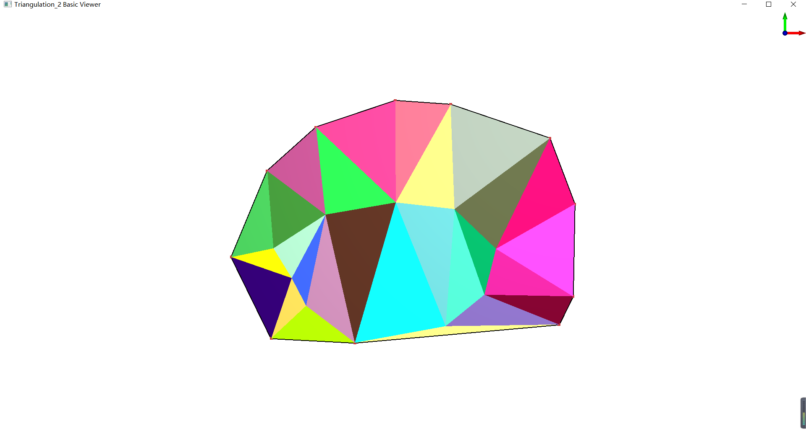

# 简单Delaunay2D 三角剖分

## Code

```cpp
#include <CGAL/Exact_predicates_exact_constructions_kernel.h>
#include <CGAL/Delaunay_triangulation_2.h>
#include <fstream>
#include <CGAL/IO/File_poly.h>
#include <CGAL/draw_triangulation_2.h>
typedef CGAL::Exact_predicates_exact_constructions_kernel K;
typedef CGAL::Delaunay_triangulation_2<K> Delaunay;
typedef K::Point_2  Point;
void write_triangle_poly_file(const Delaunay& t, std::ostream &f);

int main(){ 
    std::ifstream in("points.pts.cgal"); 
	Point p;
	std::vector<Point> points;

   // std::istream_iterator<Point> begin(in); 
    //std::istream_iterator<Point> end; 

    Delaunay dt;  
	while (in >> p) {
		// ignore whatever comes after x and y
		in.ignore((std::numeric_limits<std::streamsize>::max)(), '\n');
		points.push_back(p);
	}
	dt.insert(points.begin(), points.end());
	//dt.insert(begin, end);
	std::cout << "points: " << dt.number_of_vertices() << std::endl;
	std::cout << "triangles: " << dt.number_of_faces() << std::endl;
	std::ofstream output("out.poly");
	write_triangle_poly_file(dt, output);
	Delaunay::Finite_faces_iterator it;
	int i = 0;
	std::cout << "-------------------------------------------------------------------" << std::endl;
    for (it = dt.finite_faces_begin(); it != dt.finite_faces_end(); it++)
    {   
		std::cout << "triangle: " << i <<std::endl;
        std::cout << dt.triangle(it) << std::endl; 
        //要访问顶点可以这样写 
        std::cout<<dt.triangle(it).vertex(0).hx()<< " "<< dt.triangle(it).vertex(0).hy() <<std::endl;//得到第一个顶点坐标  
		std::cout << dt.triangle(it).vertex(1).hx() << " " << dt.triangle(it).vertex(1).hy() << std::endl;
		std::cout << dt.triangle(it).vertex(2).hx() << " " << dt.triangle(it).vertex(2).hy() << std::endl;
		std::cout << "-------------------------------------------------------------------" << std::endl;
		++i;
    }  
	CGAL::draw(dt);
    return 0;
}

void write_triangle_poly_file(const Delaunay& t, std::ostream &f) {
	typedef typename Delaunay::Vertex_handle Vertex_handle;
	typedef typename Delaunay::Finite_vertices_iterator
		Finite_vertices_iterator;
	typedef typename Delaunay::Finite_edges_iterator
		Finite_edges_iterator;

	std::map<Vertex_handle, unsigned int> index;
	// write vertices
	f << "# Shewchuk Triangle .poly file, produced by the CGAL::Mesh_2 package"
		<< std::endl
		<< "# Neither attributes nor boundary markers are used." << std::endl
		<< t.number_of_vertices() << " " << 2 << " "
		<< 0 << " " << 0 << std::endl;

	f << std::endl;

	unsigned int vertices_counter = 0;
	for (Finite_vertices_iterator vit = t.finite_vertices_begin();
		vit != t.finite_vertices_end();
		++vit)
	{
		f << ++vertices_counter << " " << vit->point() << std::endl;
		index[vit] = vertices_counter;
	}

	f << std::endl;
}
```
## CMakeLists.txt
```
cmake_minimum_required(VERSION 3.3)
project( Delaunay2D )
find_package(CGAL COMPONENTS Qt5)
add_definitions(-DCGAL_USE_BASIC_VIEWER)
#add_executable(Delaunay2D Delaunay2D.cpp)
#target_link_libraries(Delaunay2D ${CGAL_LIBRARIES})
create_single_source_cgal_program("Delaunay2D.cpp")
target_link_libraries(Delaunay2D PUBLIC CGAL::CGAL_Qt5)

```
## Result

```
points: 20
triangles: 27
-------------------------------------------------------------------
triangle: 0
65 157 -35 164 -34 -20
65 157
-35 164
-34 -20
-------------------------------------------------------------------
triangle: 1
-34 -20 -178 116 -161 -42
-34 -20
-178 116
-161 -42
-------------------------------------------------------------------
triangle: 2
65 157 72 -32 244 96
65 157
72 -32
244 96
-------------------------------------------------------------------
triangle: 3
244 96 147 -104 289 -23
244 96
147 -104
289 -23
-------------------------------------------------------------------
triangle: 4
-255 -103 -161 -42 -266 37
-255 -103
-161 -42
-266 37
-------------------------------------------------------------------
triangle: 5
-108 -274 -196 -207 -259 -266
-108 -274
-196 -207
-259 -266
-------------------------------------------------------------------
triangle: 6
56 -244 126 -187 72 -32
56 -244
126 -187
72 -32
-------------------------------------------------------------------
triangle: 7
-161 -42 -178 116 -266 37
-161 -42
-178 116
-266 37
-------------------------------------------------------------------
triangle: 8
-196 -207 -222 -157 -259 -266
-196 -207
-222 -157
-259 -266
-------------------------------------------------------------------
triangle: 9
-161 -42 -108 -274 -34 -20
-161 -42
-108 -274
-34 -20
-------------------------------------------------------------------
triangle: 10
-222 -157 -331 -119 -259 -266
-222 -157
-331 -119
-259 -266
-------------------------------------------------------------------
triangle: 11
-222 -157 -255 -103 -331 -119
-222 -157
-255 -103
-331 -119
-------------------------------------------------------------------
triangle: 12
-222 -157 -196 -207 -161 -42
-222 -157
-196 -207
-161 -42
-------------------------------------------------------------------
triangle: 13
-222 -157 -161 -42 -255 -103
-222 -157
-161 -42
-255 -103
-------------------------------------------------------------------
triangle: 14
-34 -20 -35 164 -178 116
-34 -20
-35 164
-178 116
-------------------------------------------------------------------
triangle: 15
-255 -103 -266 37 -331 -119
-255 -103
-266 37
-331 -119
-------------------------------------------------------------------
triangle: 16
-196 -207 -108 -274 -161 -42
-196 -207
-108 -274
-161 -42
-------------------------------------------------------------------
triangle: 17
72 -32 65 157 -34 -20
72 -32
65 157
-34 -20
-------------------------------------------------------------------
triangle: 18
72 -32 147 -104 244 96
72 -32
147 -104
244 96
-------------------------------------------------------------------
triangle: 19
289 -23 147 -104 286 -190
289 -23
147 -104
286 -190
-------------------------------------------------------------------
triangle: 20
72 -32 -34 -20 56 -244
72 -32
-34 -20
56 -244
-------------------------------------------------------------------
triangle: 21
147 -104 126 -187 286 -190
147 -104
126 -187
286 -190
-------------------------------------------------------------------
triangle: 22
147 -104 72 -32 126 -187
147 -104
72 -32
126 -187
-------------------------------------------------------------------
triangle: 23
126 -187 261 -241 286 -190
126 -187
261 -241
286 -190
-------------------------------------------------------------------
triangle: 24
-108 -274 56 -244 -34 -20
-108 -274
56 -244
-34 -20
-------------------------------------------------------------------
triangle: 25
261 -241 126 -187 56 -244
261 -241
126 -187
56 -244
-------------------------------------------------------------------
triangle: 26
56 -244 -108 -274 261 -241
56 -244
-108 -274
261 -241
-------------------------------------------------------------------

```
## points.pts.cgal 点集文件
```
-196 -207
-222 -157
-255 -103
-161 -42
-34 -20
72 -32
147 -104
126 -187
56 -244
-108 -274
-259 -266
-331 -119
-266 37
-178 116
-35 164
65 157
244 96
289 -23
286 -190
261 -241

```

## Explanation

点集的简单三角剖分以及顶点和三角形的遍历。
剖分结果的保存未完，待续。

## 链接

[简单Delaunay2D 三角剖分](https://github.com/wblong/CGALDemo/tree/master/Delaunay2D)