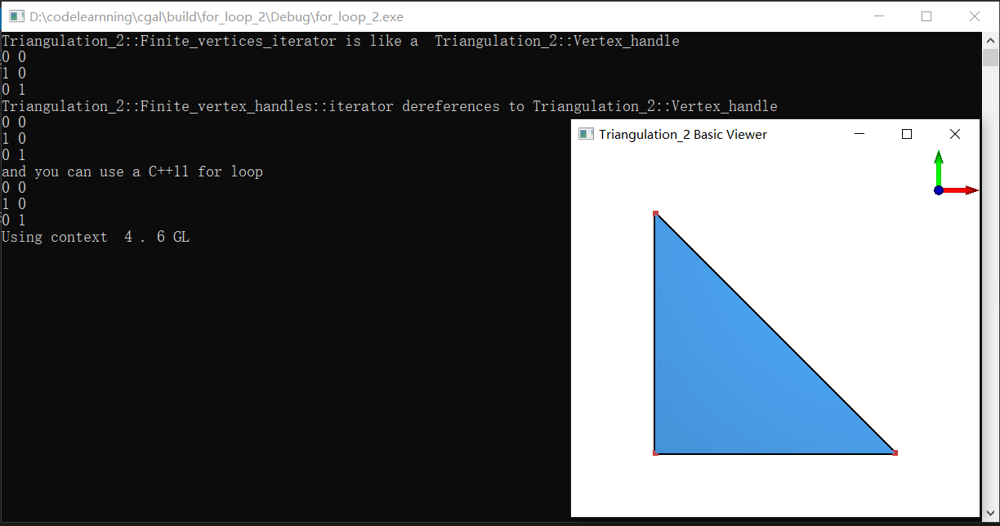

# 不同方式遍历方式遍历三角形

## Code 
```cpp
#include <CGAL/Exact_predicates_inexact_constructions_kernel.h>
#include <CGAL/Triangulation_2.h>
#include <CGAL/draw_triangulation_2.h>
#include <iostream>
#include <vector>

typedef CGAL::Exact_predicates_inexact_constructions_kernel K;
typedef CGAL::Triangulation_2<K>      Triangulation;
typedef Triangulation::Vertex_handle  Vertex_handle;
typedef Triangulation::Point          Point;
typedef Triangulation::Finite_vertex_handles    Finite_vertex_handles;
// The following types are different
// Its value type is Triangulation_2::Vertex
typedef Triangulation::Finite_vertices_iterator Finite_vertices_iterator;
// Its value type is Triangulation_2::Vertex_handle
typedef Finite_vertex_handles::iterator         Finite_vertex_handles_iterator;
int main()
{
  std::vector<Point> points =  { Point(0,0), Point(1,0), Point(0,1) };
  Triangulation T;
  T.insert(points.begin(), points.end());
  std::cout << "Triangulation_2::Finite_vertices_iterator is like a  Triangulation_2::Vertex_handle\n";
  for(Finite_vertices_iterator it = T.finite_vertices_begin();
      it != T.finite_vertices_end();
      ++it){
    std::cout << it->point() << std::endl;
  }
  std::cout << "Triangulation_2::Finite_vertex_handles::iterator dereferences to Triangulation_2::Vertex_handle\n";
  Finite_vertex_handles::iterator b, e;
  std::tie(b,e) = T.finite_vertex_handles();
  for(; b!=e; ++b){
    Vertex_handle vh = *b; // you must dereference the iterator to get a handle
    std::cout << vh->point() << std::endl;
  }
  
  std::cout << "and you can use a C++11 for loop\n";
  for(Vertex_handle vh : T.finite_vertex_handles()){
    std::cout << vh->point() << std::endl;
  }
  CGAL::draw(T);
  return 0;
}
```

## Result



## Explanation

1. `Triangulation::Finite_vertices_iterator`
   
2. `Triangulation_2::Finite_vertex_handles::iterator`
   
3. `Triangulation_2::Finite_vertex_handles::iterator` && `C++11`
   
## 链接

[不同方式遍历方式遍历三角形](https://github.com/wblong/CGALDemo/tree/master/for_loop_2)

## Reference

[Basic Triangulations](https://doc.cgal.org/latest/Triangulation_2/index.html#Section_2D_Triangulations_Delaunay)